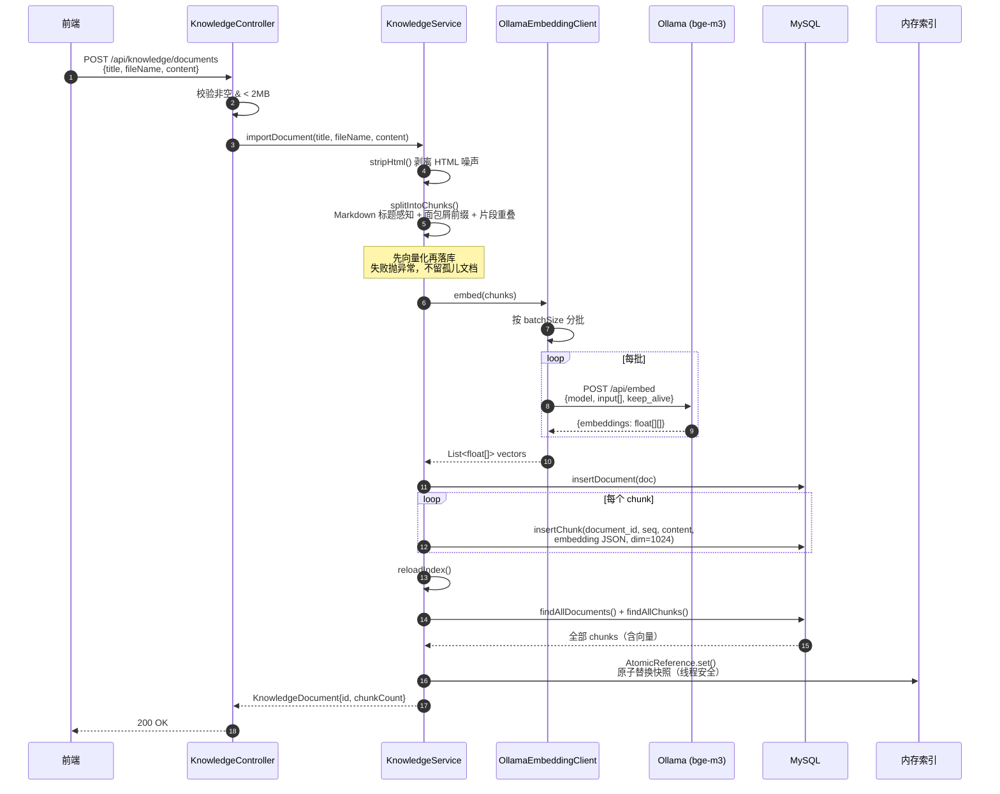
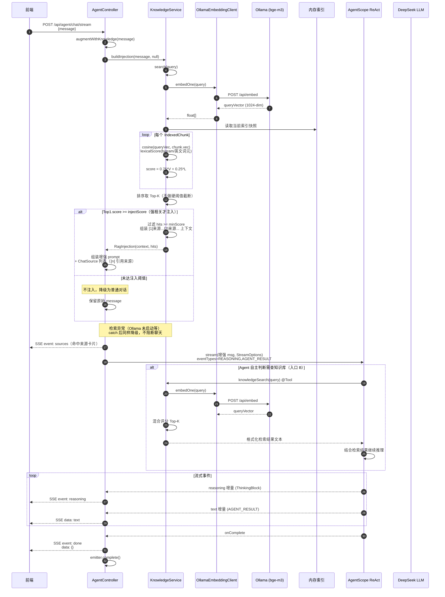

# JARVIS

> DeepSeek Harness 风格的自主智能体（Agent）后台，基于 Spring Boot 4 + H2 + MyBatis + AgentScope，前端使用 React + Ant Design。

## 特性

- 🤖 **AgentScope ReAct Agent**：Tool calling（任务库 + MCP + 知识库搜索）+ DeepSeek 流式响应
- 🧩 **MCP 集成**：stdio / SSE / streamableHttp 三种传输，声明式注册
- 📚 **简易 RAG 知识库**：
  - 本地 Ollama（默认 bge-m3，1024 维）段落感知分块 + 向量化
  - H2 knowledge_document / knowledge_chunk 持久化
  - 内存 cosine Top-K 相似度检索
  - **双入口**：对话前自动 prompt 注入（带 [n] 引用与来源卡片）+ `knowledgeSearch` Agent 工具
- 📊 **RAG 评测系统**：40 条标注集回归 + 历史归档与趋势 diff + pre-push/CI 触发 + 候选池流水线（Chat 👎 → 转正进标注集）+ 前端评测中心（`/eval`）
- 🖥️ **管理后台**：仪表盘 / AI 对话（SSE 流式）/ 任务 / 智能体 / 知识库（前端上传 .md/.txt）/ 评测中心
- 🐳 **一键 Docker Compose**：前后端 + Ollama，自动拉 bge-m3、named volume 持久化

## RAG 执行流程

本节用时序图展示 JARVIS RAG 的两条主链路：**离线文档导入（向量化入库）** 与 **在线对话检索增强（双入口 + SSE 流式）**。

### 一、文档导入：向量化入库



**关键设计点：**
- **失败安全导入**：[KnowledgeService.importDocument](file:///Users/rocky/study/profile/Markdown-Resume/repo/JARVIS/src/main/java/com/example/jarvis/rag/KnowledgeService.java#L82-L117) 先调用 `embeddingClient.embed()` 完成全部向量化，再执行任何 DB 写入；若 Ollama 不可用则直接抛异常，不会留下"有文档无向量"的孤儿记录。
- **分批向量化**：[OllamaEmbeddingClient.embed](file:///Users/rocky/study/profile/Markdown-Resume/repo/JARVIS/src/main/java/com/example/jarvis/rag/OllamaEmbeddingClient.java#L49-L64) 按 `rag.embedding.batch-size`（默认 4）拆分请求，避免 CPU 推理单批过久撞 HTTP 超时墙；每批带 `keep_alive=60m` 防止模型冷加载。
- **Markdown 标题感知分块**：`splitIntoChunks()` 维护标题栈生成"面包屑"前缀（如 `团队手册 > 报销制度`），块自带语义上下文；相邻块保留 overlap 重叠保证跨块语义连续。
- **原子内存索引**：索引用 `AtomicReference<List<IndexedChunk>>` 写时复制，查询无锁读取快照，导入/删除后整体替换，线程安全。

### 二、对话检索增强：双入口 + SSE 流式



**关键设计点：**
- **双入口检索**：
  - **入口 A（对话前自动注入）**：[AgentController.augmentWithKnowledge](file:///Users/rocky/study/profile/Markdown-Resume/repo/JARVIS/src/main/java/com/example/jarvis/controller/AgentController.java#L149-L189) 在调用 Agent 前检索，强相关命中时把带 `[n]` 编号的片段拼进 prompt，并要求模型用 `[n]` 标注来源；前端先收到 `sources` 事件渲染来源卡片。
  - **入口 B（Agent 工具调用）**：[KnowledgeSearchTools.knowledgeSearch](file:///Users/rocky/study/profile/Markdown-Resume/repo/JARVIS/src/main/java/com/example/jarvis/rag/KnowledgeSearchTools.java#L22-L45) 作为 `@Tool` 注册到 AgentScope Toolkit，ReAct Agent 在推理中自主决定是否调用，适合弱相关或需要多次检索的场景。
- **混合评分**：[KnowledgeService.search](file:///Users/rocky/study/profile/Markdown-Resume/repo/JARVIS/src/main/java/com/example/jarvis/rag/KnowledgeService.java#L149-L175) 对每个 chunk 计算 `score = 0.75 * 向量 cosine + 0.25 * 词面重合度`；词面分用中文 bigram + 英文/数字词元，兜住产品名、型号等向量不敏感的精确词。检索阶段不做硬阈值截断，保证"搜不到"与"分数低"可区分。
- **双阈值注入门控**：[buildInjection](file:///Users/rocky/study/profile/Markdown-Resume/repo/JARVIS/src/main/java/com/example/jarvis/rag/KnowledgeService.java#L184-L202) 要求 **Top1 必须 ≥ injectScore** 才触发注入（避免弱相关噪声污染 prompt），再用 **minScore** 过滤剩余片段；落在此区间外的域内问题由 Agent 自主判断走工具入口 B。
- **优雅降级**：检索链路任意异常（Ollama 未启动、embedding 超时等）被 `catch` 后返回原始消息，聊天不中断，仅失去 RAG 增强。
- **SSE 流式闭环**：[AgentController.chatStream](file:///Users/rocky/study/profile/Markdown-Resume/repo/JARVIS/src/main/java/com/example/jarvis/controller/AgentController.java#L57-L88) 先发 `sources` 事件，再逐帧推送 `reasoning`/text 增量；onComplete 回调显式发送 `done` 帧后才 `emitter.complete()`，确保前端 `for await` 循环能正常终止、发送按钮复位。

## 快速开始

### 方式 A：Docker 部署（推荐演示/生产）

```bash
cp deploy/.env.example .env     # 至少填 AGENTSCOPE_API_KEY
./deploy.sh up                  # 构建 + 启动，首次需要几分钟（编译+拉 bge-m3）
./deploy.sh check               # 验证就绪后：
open http://localhost:8080      # 访问前端
```

### 方式 B：本地开发（Java + Node）

详见 [docs/setup-guide.md](docs/setup-guide.md)。简要：

1. 本机安装 JDK 17+、Node 20+、Ollama
2. `ollama pull bge-m3`
3. 设置 3 个环境变量：`AGENTSCOPE_API_KEY / AGENTSCOPE_BASE_URL / AGENTSCOPE_MODEL`
4. 后端 `./mvnw spring-boot:run`（8080）
5. 前端 `cd web && npm install && npm run dev`（5173）
6. 访问 http://localhost:5173/

## 文档

| 文档 | 说明 |
|---|---|
| [docs/setup-guide.md](docs/setup-guide.md) | **完整启动与配置指南**（环境 → MySQL → Ollama & bge-m3 详解 → 启动 → RAG 使用 → 评测系统 → Docker 部署）|
| [docs/rag-design.md](docs/rag-design.md) | **RAG 设计文档**（工作流程与原理 → 缺点 → Phase 1~3 演进路线 → 评测基线与归档）|
| [docs/llm-wiki-research.md](docs/llm-wiki-research.md) | LLM Wiki / 知识编译技术调研（M1~M3 选型）|
| [docs/java-dsh-design.md](docs/java-dsh-design.md) | JARVIS = DeepSeek Harness（DSH）Java 版 架构设计稿（M1~M5）|

## 目录

```
├── docker-compose.yml        Compose 编排（前后端 + Ollama + 可选 WebUI）
├── deploy.sh                 一键脚本：up/down/check/backup/logs/ps
├── deploy/
│   ├── Dockerfile.backend    后端：Maven 构建 + JRE 运行
│   ├── Dockerfile.frontend   前端：Vite build + Nginx 反代
│   ├── nginx.conf.template   Nginx 模板（/api 反代 + SSE 无缓冲）
│   └── .env.example          环境变量模板
├── src/                      后端 Java 代码（Spring Boot 4 / MyBatis / MySQL / AgentScope / RAG）
│   └── main/java/com/example/jarvis/rag/   RAG 核心（Ollama 客户端 + KnowledgeService）
├── web/                      前端 React + Ant Design（Vite）
├── docs/                     设计 & 指南文档
└── log/                      Logback 落盘日志（开发模式）
```
